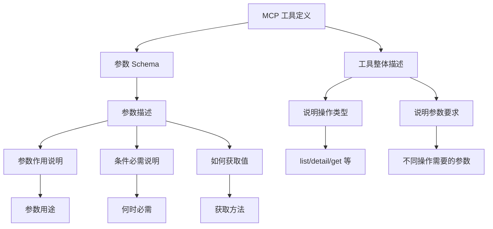

# 技术方案设计

## 概述

本方案旨在通过改进 MCP 工具的参数描述和工具整体描述，使条件必需参数的要求更加清晰明确，帮助 AI 正确理解和使用工具。方案采用描述文本改进的方式，不改变代码逻辑和运行时验证，确保向后兼容。

## 技术架构

### 改进策略

采用**描述文本优化**策略，通过以下方式改进：

1. **参数描述改进**：将简短的条件必需说明改为详细、明确的描述
2. **工具整体描述改进**：在工具 description 中明确说明不同操作类型的参数要求
3. **统一描述规范**：建立描述模板，确保一致性

### 架构图



## 技术选型

### 描述改进方式

1. **直接修改描述文本**：在现有 Zod schema 的 `describe()` 方法中更新描述
2. **保持代码结构不变**：不改变参数类型、验证逻辑、默认值等
3. **参考最佳实践**：以 `queryCloudRun` 工具的描述方式为模板

### 描述规范模板

#### 条件必需参数描述模板

```
{参数作用说明}。当 {条件} 时，此参数为必填项，必须提供 {参数要求}。{如何获取值说明}（如适用）
```

**示例：**
- 当前：`"函数名称（detail 操作时必需）"`
- 改进后：`"要查询的函数名称。当 action='detail' 时，此参数为必填项，必须提供已存在的函数名称。可通过 action='list' 操作获取可用的函数名称列表"`

#### 工具整体描述模板

```
{工具功能说明}。通过 action 参数区分操作类型：{操作1}={说明1}（{参数要求1}），{操作2}={说明2}（{参数要求2}）
```

**示例：**
- 当前：`"获取云函数列表或单个函数详情，通过 action 参数区分操作类型"`
- 改进后：`"获取云函数列表或单个函数详情。通过 action 参数区分操作类型：list=获取函数列表（默认，无需额外参数），detail=获取函数详情（需要提供 name 参数指定函数名称）"`

## 具体改进内容

### 1. getFunctionList 工具改进

#### 工具整体描述改进

**文件：** `mcp/src/tools/functions.ts`

**当前：**
```typescript
description: "获取云函数列表或单个函数详情，通过 action 参数区分操作类型"
```

**改进后：**
```typescript
description: "获取云函数列表或单个函数详情。通过 action 参数区分操作类型：list=获取函数列表（默认，无需额外参数），detail=获取函数详情（需要提供 name 参数指定函数名称）"
```

#### 参数描述改进

**name 参数：**

**当前：**
```typescript
name: z.string().optional().describe("函数名称（detail 操作时必需）")
```

**改进后：**
```typescript
name: z.string().optional().describe("要查询的函数名称。当 action='detail' 时，此参数为必填项，必须提供已存在的函数名称。可通过 action='list' 操作获取可用的函数名称列表")
```

**action 参数：**

**当前：**
```typescript
action: z.enum(["list", "detail"]).optional().describe("操作类型：list=获取函数列表（默认），detail=获取函数详情")
```

**改进后：**
```typescript
action: z.enum(["list", "detail"]).optional().describe("操作类型：list=获取函数列表（默认，无需额外参数），detail=获取函数详情（需要提供 name 参数）")
```

### 2. queryDataModel 工具改进

#### 工具整体描述改进

**文件：** `mcp/src/tools/dataModel.ts`

**当前：**
```typescript
description: "数据模型查询工具，支持查询和列表数据模型（只读操作）。list操作返回基础信息（不含Schema），get操作返回详细信息（含简化的Schema，包括字段列表、格式、关联关系等），docs操作生成SDK使用文档"
```

**改进后：**
```typescript
description: "数据模型查询工具，支持查询和列表数据模型（只读操作）。通过 action 参数区分操作类型：list=获取模型列表（不含Schema，可选 names 参数过滤），get=查询单个模型详情（含Schema字段列表、格式、关联关系等，需要提供 name 参数），docs=生成SDK使用文档（需要提供 name 参数）"
```

#### 参数描述改进

**name 参数：**

**当前：**
```typescript
name: z.string().optional().describe("模型名称（get操作时必填）")
```

**改进后：**
```typescript
name: z.string().optional().describe("要查询的数据模型名称。当 action='get' 或 action='docs' 时，此参数为必填项，必须提供已存在的数据模型名称。可通过 action='list' 操作获取可用的模型名称列表")
```

## 实施策略

### 阶段 1：核心工具改进
1. 改进 `getFunctionList` 工具的描述
2. 改进 `queryDataModel` 工具的描述

### 阶段 2：验证和测试
1. 验证描述文本的清晰度
2. 确保向后兼容性
3. 检查工具文档生成是否正常

### 阶段 3：扩展改进（可选）
1. 检查其他工具是否存在类似问题
2. 建立描述规范文档
3. 更新开发指南

## 技术细节

### 描述文本要求

1. **明确性**：使用明确的措辞，如"当...时必需提供"、"此参数为必填项"
2. **完整性**：包含参数作用、条件、要求、获取方法等关键信息
3. **一致性**：遵循统一的描述格式和措辞
4. **可操作性**：提供如何获取参数值的指导

### 向后兼容性保证

1. **不改变参数类型**：保持 `z.string().optional()` 等类型定义
2. **不改变验证逻辑**：保持现有的运行时验证
3. **不改变默认值**：保持现有的默认值设置
4. **仅改进描述文本**：只修改 `describe()` 方法中的文本内容

### 工具文档生成

改进后的描述会自动通过 `scripts/generate-tools-doc.mjs` 生成到文档中，确保文档与代码同步更新。

## 风险评估

### 低风险
- 仅修改描述文本，不改变代码逻辑
- 向后兼容，不影响现有调用
- 改进方向明确，参考已有最佳实践

### 注意事项
- 描述文本不宜过长，保持可读性
- 确保描述准确反映实际行为
- 保持与现有文档风格一致

## 测试策略

### 验证点
1. 描述文本清晰度：AI 能否正确理解参数要求
2. 工具调用正确性：改进后工具调用是否正常工作
3. 文档生成正确性：生成的工具文档是否包含改进后的描述
4. 向后兼容性：现有调用是否仍然有效

### 测试方法
1. 代码审查：检查描述文本是否符合规范
2. 文档检查：验证生成的文档是否正确
3. 功能测试：确保工具功能不受影响
